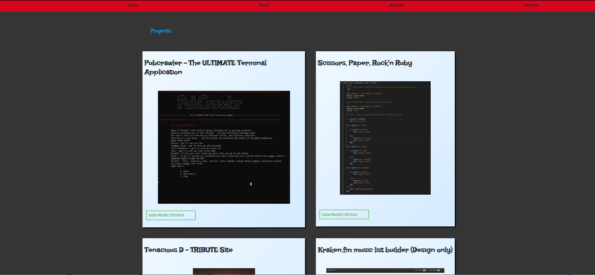

# Portfolio

### LINK TO SITE:
### https://davidjono1985.github.io/Portfolio/

### GITHUB:
#### https://github.com/davidjono1985/Portfolio

### TRELLO:
#### https://trello.com/invite/b/CllWj1Xx/d6a663c631d8f954ada146cb253d0f6f/portfolio

## PURPOSE: 

The purpose of my website is to outline my skills as a designer and developer, showcase my previous projects and provide links to all of my social media.

## TARGET AUDIENCE:
My target audience consists of my peers as well as prospective employers or investors.  

## TECH STACK:
html and scss (by using scss) - deployed on Github. 
Target audience: My target audience consists of my peers and prospective employers or investors.  
Tech stack: html and scss (by using scss) - deployed on Github. 

 ## FUNCTIONALITY / FEATURES: 
The design, layout, colours and fonts were chosen for my website in order to maximise "ease of use" for the user. Here are some of the components:

### COMPONENT 1
The First component I would like to mention is the NAV bar.  At full-screen it is sticky and remains at the top of the screen as the user scrolls down.  On mobile it is a hamburger selector that the user clicks on to navigate to the specific sections

### COMPONENT 2
The second component is in the "projects section".  Each project is contained in it's own boxed section with title and a descriptive image.  There is also a link on each which takes to a page specific to that project which contains further details and gives the user the ability to return to the main portfolio

### COMPONENT 3
The third component is the plethora of Links – starting with the "View Work History (Resume)" button found at the bottom of the projects section. The button changes colour when hovered on and directly links to a PDF version of my RESUME. The same hover approach has been incorporated for all of my social media links. I have also added “words” within paragraphs that link to external websites.

### COMPONENT 4
Lastly I would like to make mention of the contact form in the "contact" section of the website.  It allows the user to enter their name, email and message and allows for this information to be directed to my personal email address.  

## MOOD BOARD:
 

## SITE MAP:
 

## WEB SCREENSHOTS:

## MOBILE SCREENSHOTS: 

